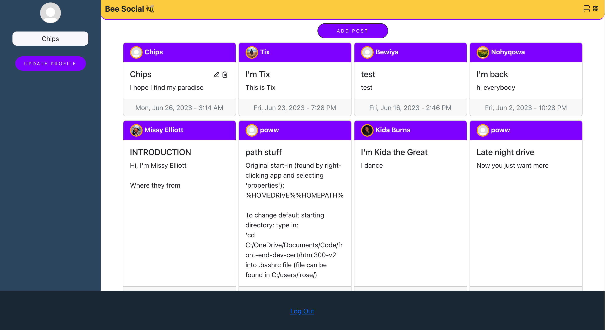
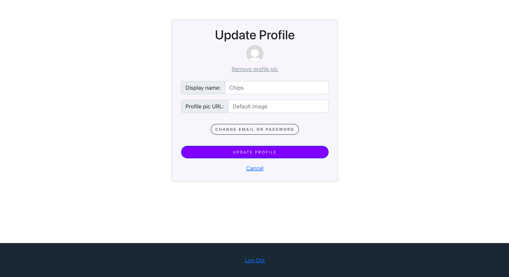
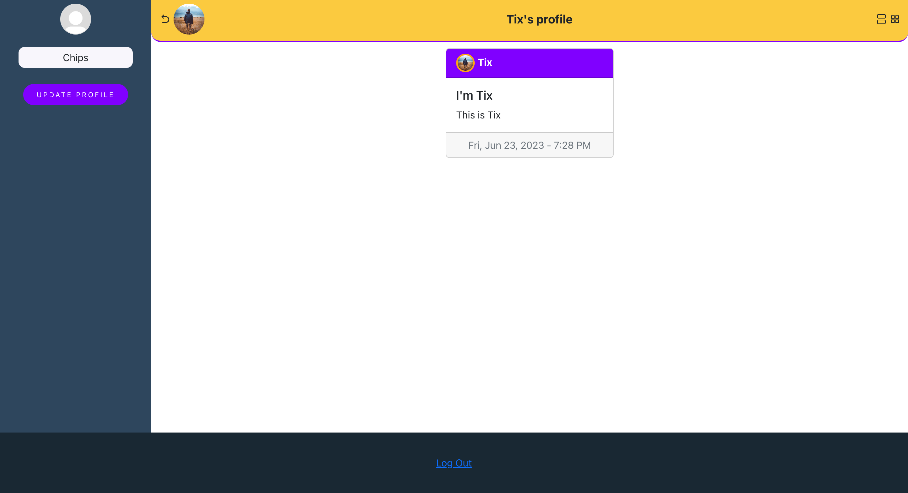

# Bee Social (Social Posts App)

Front-end to MERN full-stack app with CRUD operations that displays posts from multiple users and uses MongoDB to enable users to create, update and delete their posts.

This is a web app for users who want to share posts with their friends and colleagues. Made to practice my auth skills and MERN stack development.

Live site: <https://social-posts-app.netlify.app/>

This project was bootstrapped with [Create React App](https://github.com/facebook/create-react-app).

## Author: Jelani R

## Version: 1.1.2

## Project Images

## Architecture

This web app is built in React with JavaScript, JSX, and SASS/SCSS, and uses: Firebase (auth), Bootstrap/React Bootstrap, React Router, MongoDB (backend), and Axios.

## Changelog

- 10-04-2023 10:22pm - (1.1.2) Sends user a email verification link if their email is not verified when they try to log in after changing their email. Added images to README.
- 06-23-2023 6:55pm - (1.1.1) Fixed bug where profile wasn't updating for new users.
- 06-07-2023 10:31pm - (1.1.0) Users can navigate to someone's profile by clicking a user's name on their post.
- 06-02-2023 6:50pm - (1.0.0) Users can perform CRUD operations on posts and update their profile.
- 06-01-2023 3:00pm - (0.1.0) Initial commit with Firebase auth set up.

## My Resources

- [Firebase](https://firebase.google.com/)
- [React Icons](https://react-icons.github.io/react-icons/)
- [React Authentication Crash Course With Firebase And Routing by WebDevSimplied](https://youtu.be/PKwu15ldZ7k)
<!-- - [Checking if a URL is active](https://stackoverflow.com/questions/3915634/checking-if-a-url-is-broken-in-javascript) -->

## Project setup

### Back-end setup

- Needs server. Can clone [backend here](https://github.com/Jchips/social-posts-backend).
- Needs MongoDB database to be created. Create .env file in backend code and copy the database link into the .env file.
- Check [.env.sample](https://github.com/Jchips/social-posts-backend/blob/main/.env.sample) in backend code for any other needed environment variables.
- Run `npm install` in terminal to install dependencies.
- Run the backend code using `nodemon` in terminal or `npm start` if you don't have nodemon installed.

### Front-end setup

- Create .env file.
- Copy the link to your server into the .env file.
- Create a Firebase web app project and register app. [Click here for help on how to do that](https://firebase.google.com/docs/web/setup).
- Initialize Firebase project by copying your Firebase project configuration into your .env file. Can look at [.env.sample](.env.sample) for reference. If your project configuration doesn't show, you can find it in your Firebase project by going to Project Overview > Project Settings.
- Set up email/password login in Authentication in Firebase project.
- Run `npm install` in terminal to install dependencies.
- Run the project using `npm start` in terminal.
- You will have to use a real email address to sign up for the Bee Social app (one that you can access). If you don't want to use a personal one, you can use a temporary one by Googling 'Temp mail' and finding a site you like to give you a temporary email address.

## Available Scripts

In the project directory, you can run:

### `npm start`

Runs the app in the development mode.\
Open [http://localhost:3000](http://localhost:3000) to view it in your browser.

The page will reload when you make changes.\
You may also see any lint errors in the console.

### `npm test`

Launches the test runner in the interactive watch mode.\
See the section about [running tests](https://facebook.github.io/create-react-app/docs/running-tests) for more information.

### `npm run build`

Builds the app for production to the `build` folder.\
It correctly bundles React in production mode and optimizes the build for the best performance.

The build is minified and the filenames include the hashes.\
Your app is ready to be deployed!

See the section about [deployment](https://facebook.github.io/create-react-app/docs/deployment) for more information.

### `npm run eject`

**Note: this is a one-way operation. Once you `eject`, you can't go back!**

If you aren't satisfied with the build tool and configuration choices, you can `eject` at any time. This command will remove the single build dependency from your project.

Instead, it will copy all the configuration files and the transitive dependencies (webpack, Babel, ESLint, etc) right into your project so you have full control over them. All of the commands except `eject` will still work, but they will point to the copied scripts so you can tweak them. At this point you're on your own.

You don't have to ever use `eject`. The curated feature set is suitable for small and middle deployments, and you shouldn't feel obligated to use this feature. However we understand that this tool wouldn't be useful if you couldn't customize it when you are ready for it.

## Learn More

You can learn more in the [Create React App documentation](https://facebook.github.io/create-react-app/docs/getting-started).

To learn React, check out the [React documentation](https://reactjs.org/).

### Code Splitting

This section has moved here: [https://facebook.github.io/create-react-app/docs/code-splitting](https://facebook.github.io/create-react-app/docs/code-splitting)

### Analyzing the Bundle Size

This section has moved here: [https://facebook.github.io/create-react-app/docs/analyzing-the-bundle-size](https://facebook.github.io/create-react-app/docs/analyzing-the-bundle-size)

### Making a Progressive Web App

This section has moved here: [https://facebook.github.io/create-react-app/docs/making-a-progressive-web-app](https://facebook.github.io/create-react-app/docs/making-a-progressive-web-app)

### Advanced Configuration

This section has moved here: [https://facebook.github.io/create-react-app/docs/advanced-configuration](https://facebook.github.io/create-react-app/docs/advanced-configuration)

### Deployment

This section has moved here: [https://facebook.github.io/create-react-app/docs/deployment](https://facebook.github.io/create-react-app/docs/deployment)

### `npm run build` fails to minify

This section has moved here: [https://facebook.github.io/create-react-app/docs/troubleshooting#npm-run-build-fails-to-minify](https://facebook.github.io/create-react-app/docs/troubleshooting#npm-run-build-fails-to-minify)
