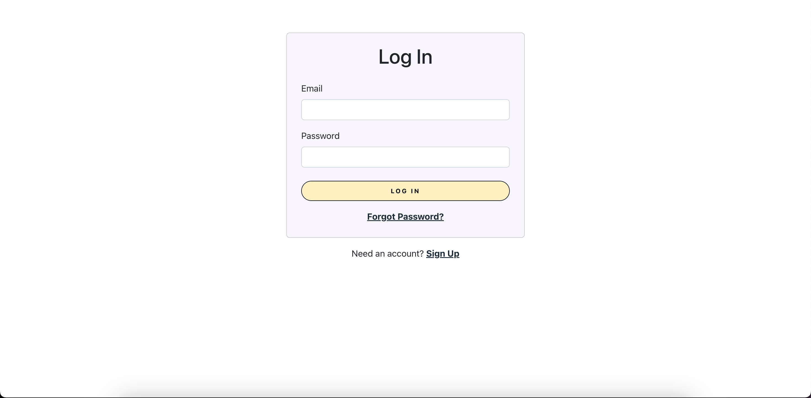
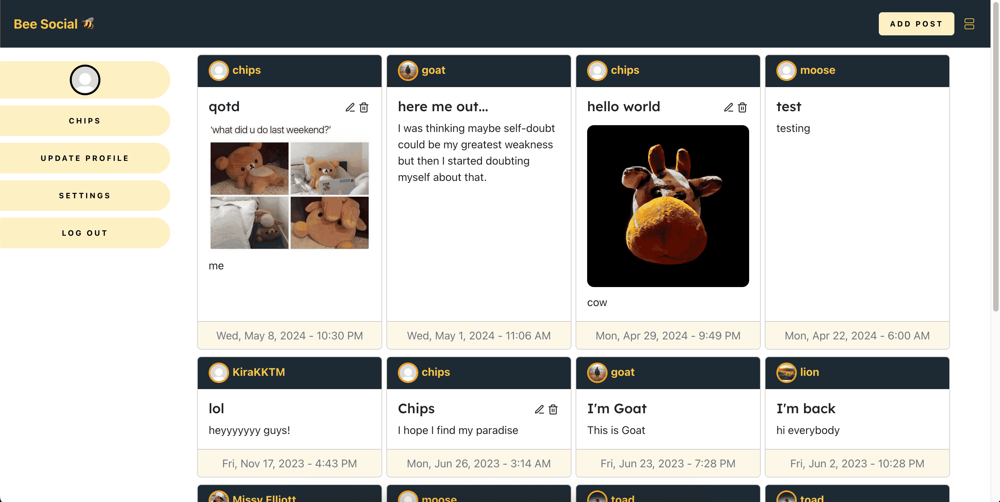
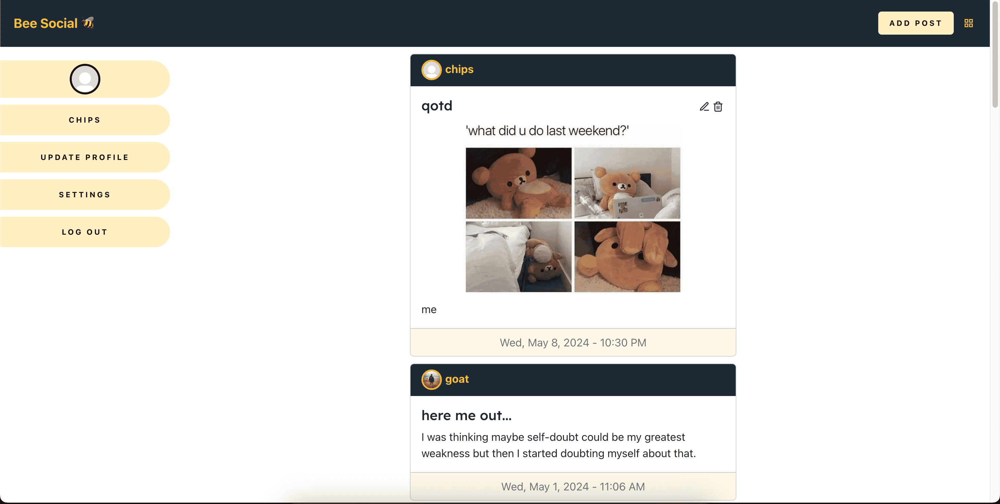
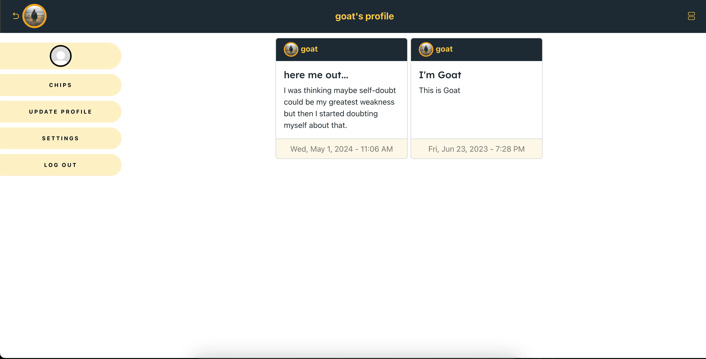
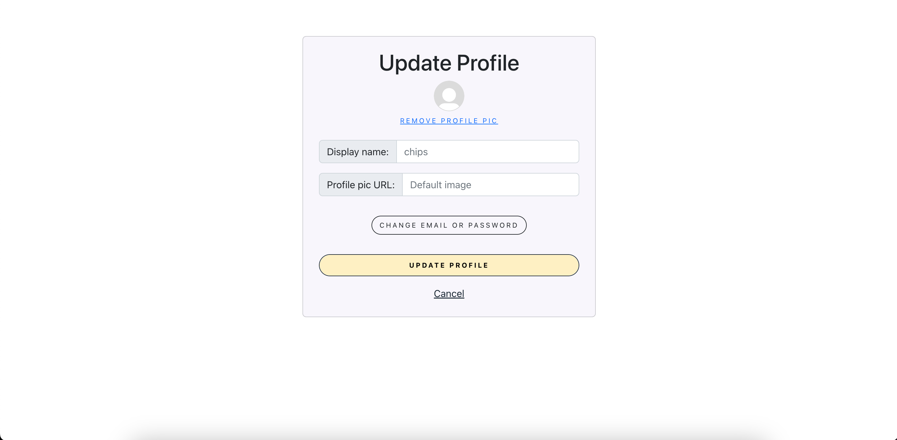

# Bee Social (social app)

## Description

Bee Social is a web app for users who want to share posts with their friends. 

Users can sign up with their email address, share image posts or plain text, edit & delete created posts, view other users' profiles, update profile and account information.

> A fun and simple way to socialize with others by sharing a quick pic and comment.

Live site: [https://beesocialhub.netlify.app](https://beesocialhub.netlify.app)

## Author: Jelani R

## Version: 2.3.0

## Project Images

## Architecture

Built with React, Firebase Auth, Cloud Firestore, Firebase Storage, Bootstrap, MongoDB

Languages used: JavaScript and SASS.

This project was bootstrapped with [Create React App](https://github.com/facebook/create-react-app).

> Note: The text posts used to be stored in MongoDB but after adding the ability to post images, I switched to using Cloud Firestore for all new posts.

## Resources

- [Firebase](https://firebase.google.com/)
- [React Icons](https://react-icons.github.io/react-icons/)
- [uuid package](https://github.com/uuidjs/uuid#readme)
- [React Authentication Crash Course With Firebase And Routing by Web Dev Simplified](https://youtu.be/PKwu15ldZ7k)
- [How To Build A Google Drive Clone With Firebase by Web Dev Simplified](https://youtu.be/6XTRElVAZ9Y)
- Google Font: 'Lexend Deca' by Bonnie Shaver-Troup, Thomas Jockin, Santiago Orozco, Héctor Gómez, Superunion.

## Project setup

### Back-end setup

- Needs server. Can clone [backend here](https://github.com/Jchips/bee-social-backend).
- Needs MongoDB database to be created with Users table. Create `.env` file in backend code and copy the database link into the .env file.
- Check [.env.sample](https://github.com/Jchips/bee-social-backend/blob/main/.env.sample) in backend code for any other needed environment variables.
- Run `npm install` in terminal to install dependencies.
- Run the backend code using `nodemon` in terminal or `npm start` if you don't have nodemon installed.

### Front-end setup

- Create `.env` file.
- Copy the link to your server into the `.env` file.
- Create a Firebase web app project and register app. [Click here for help on how to do that](https://firebase.google.com/docs/web/setup).
- Initialize Firebase project by copying your Firebase project configuration into your `.env` file. If your project configuration doesn't show, you can find it in your Firebase project by going to Project Overview > Project Settings.
- Set up email/password login in Authentication in Firebase project.
- Set up Cloud Firestore database in Firebase project.
- Set up Storage in Firebase project.
- Make sure to add all Firebase connection links to your `.env` file. Can look at [.env.sample](.env.sample) for reference.
- Run `npm install` in terminal to install dependencies.
- Run the project using `npm start` in terminal.
- You will have to use a real email address to sign up for the Bee Social app (one that you can access). If you don't want to use a personal one, you can use a temporary one by Googling 'Temp mail' and finding a site you like to give you a temporary email address.

## Changelog

- 07-02-2024 9:16pm - (2.3.0) Users can now delete their accounts. Improved mobile viewing experience.
- 05-08-2024 5:29am - (2.2.0) - New UI. Added delete post confirmation.
- 05-04-2024 3:28pm - (2.1.0) - No longer adds new posts to MongoDB (only adds to Firestore database from here on out). Style edits.
- 05-01-2024 3:38pm - (2.0.0) - Added the ability to upload images.
- 04-22-2024 7:00am - (1.1.3) Refactored code because it was messy.
- 10-04-2023 10:22pm - (1.1.2) Sends user a email verification link if their email is not verified when they try to log in after changing their email. Added images to README.
- 06-23-2023 6:55pm - (1.1.1) Fixed bug where profile wasn't updating for new users.
- 06-07-2023 10:31pm - (1.1.0) Users can navigate to someone's profile by clicking a user's name on their post.
- 06-02-2023 6:50pm - (1.0.0) Users can perform CRUD operations on posts and update their profile.
- 06-01-2023 3:00pm - (0.1.0) Initial commit with Firebase auth set up.
